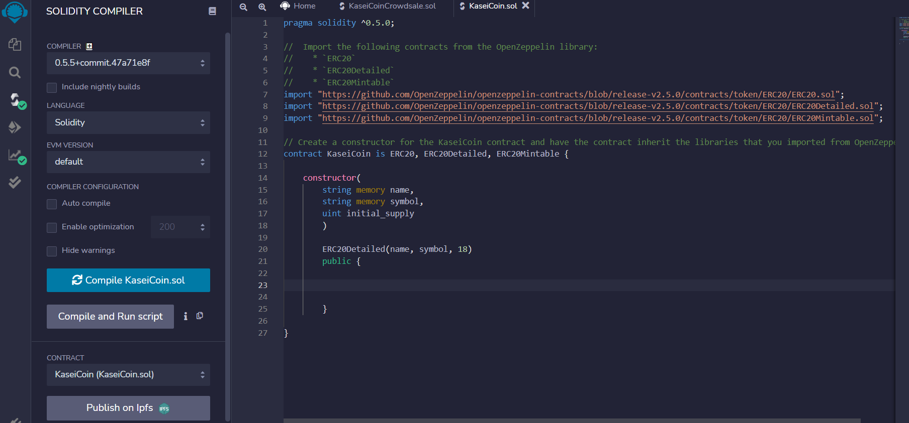
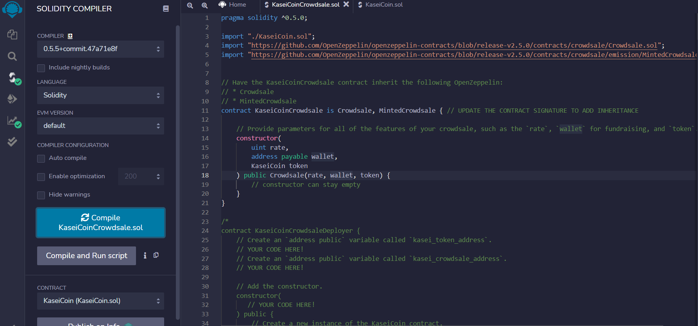
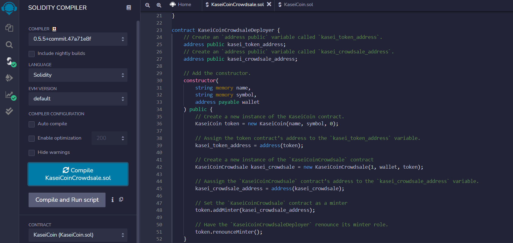
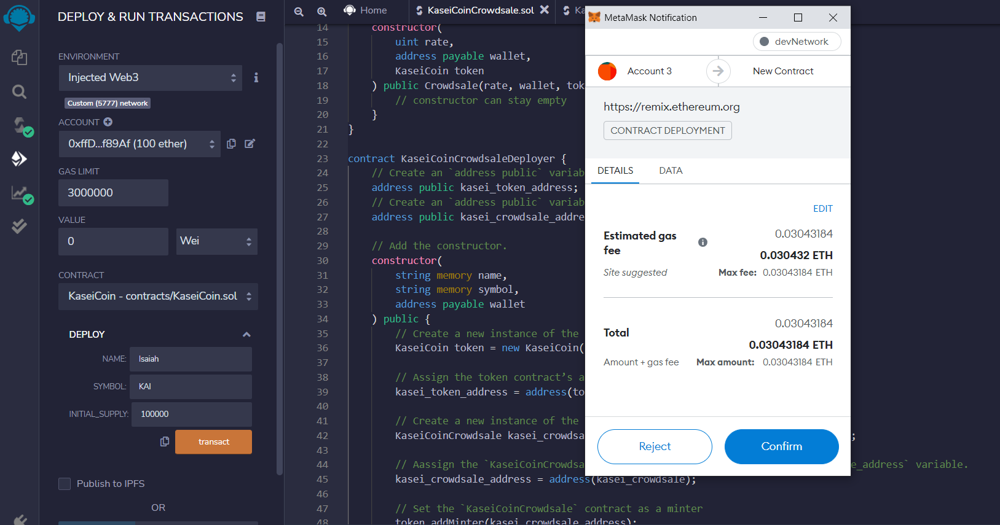
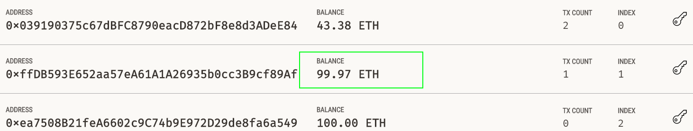
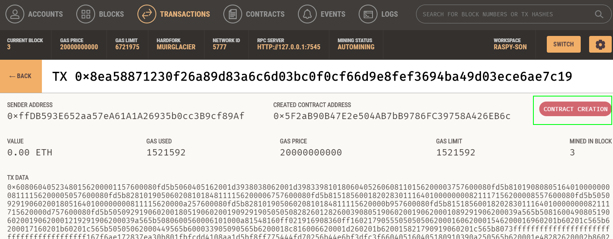
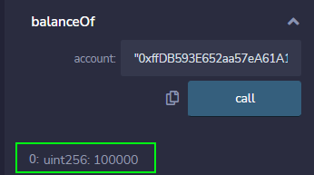
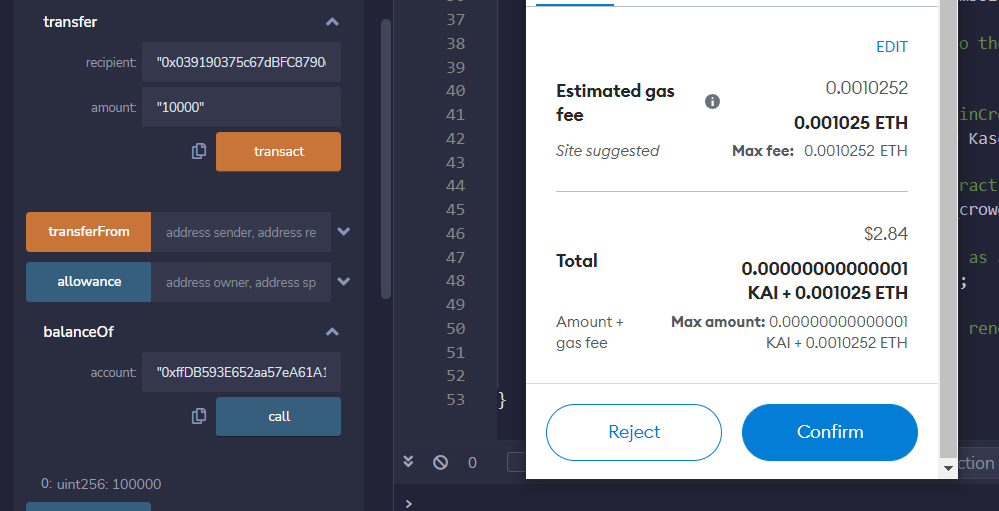
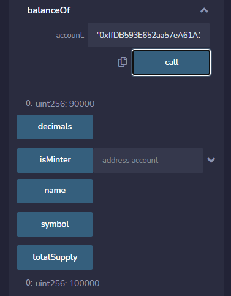

# Cryptocurrency_Interplanetary_Crowdsale

The Solidity smart contracts seen here are meant to demonstrate how transactions over blockchain using ERC20 standard smart contracts work using a non-existent cryptocurrncy as an example.
The smart contracts are made using solidity over the Remix IDE. They are then used to make transactions between acccounts on Ganache. The Remix IDE and Ganache are connected together via MetaMask.

---

## Technologies

### Libraries (Contracts):
* ERC20
* ERC20Detailed
* ERC20Mintable
* Crowdsale
* MintedCrowdsale

The language of this application is Solidity on the (online) Remix integrated development environment. The libraries used that come with it are all listed above.

---

## Library (Contract) Usage Guide

To use ERC20, enter `import "https://github.com/OpenZeppelin/openzeppelin-contracts/blob/release-v2.5.0/contracts/token/ERC20/ERC20.sol";` to the program before starting the contract.

To use ERC20Detailed, enter `import "https://github.com/OpenZeppelin/openzeppelin-contracts/blob/release-v2.5.0/contracts/token/ERC20/ERC20Detailed.sol";` to the program before starting the contract.

To use ERC20Mintable, enter `import "https://github.com/OpenZeppelin/openzeppelin-contracts/blob/release-v2.5.0/contracts/token/ERC20/ERC20Mintable.sol";` to the program before starting the contract.

To use Crowdsale, enter `import "https://github.com/OpenZeppelin/openzeppelin-contracts/blob/release-v2.5.0/contracts/crowdsale/Crowdsale.sol";` to the program before starting the contract.

To use MintedCrowdsale, enter `import "https://github.com/OpenZeppelin/openzeppelin-contracts/blob/release-v2.5.0/contracts/crowdsale/emission/MintedCrowdsale.sol";` to the program before starting the contract.

---

## Evaluation Evidence

#### Main Kasei Coin Contract:

#### Kasei Coin Crowdsale Contract:

#### Kasei Coin Crowdasale Contract Deployer:

!

#### Initial Transaction:

#### Ganache Confirmations of Initial Transaction:

#### Balance after Initial Transaction:

#### Transfer of KAI to Other Account:

#### Confirmations of Transfer of KAI to Other Account:

These photos are of the whole process of an initial minting of tokens for use, then the transference of them to another account in the blockchain, and the confirmation on the contract of the total raised and total balances per account.

---

## Contributor

Isaiah T Tensae